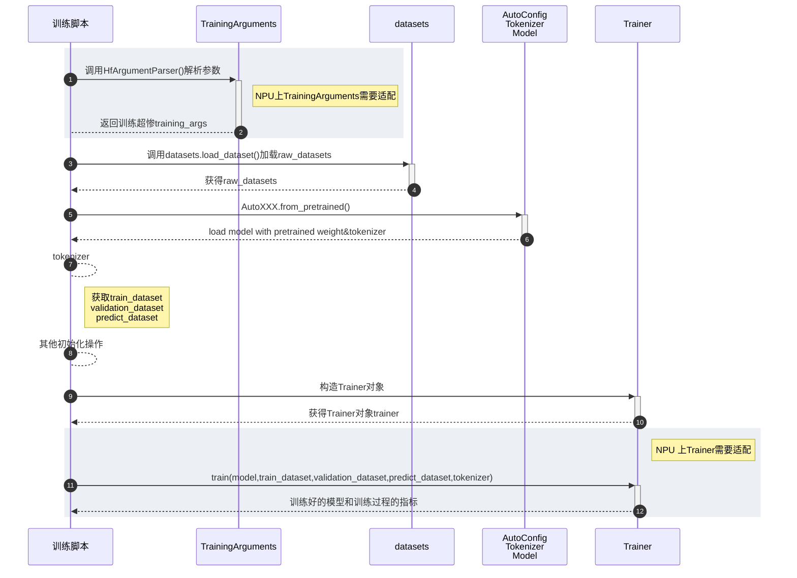
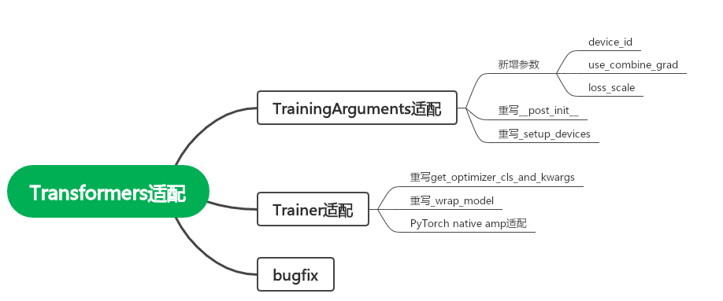
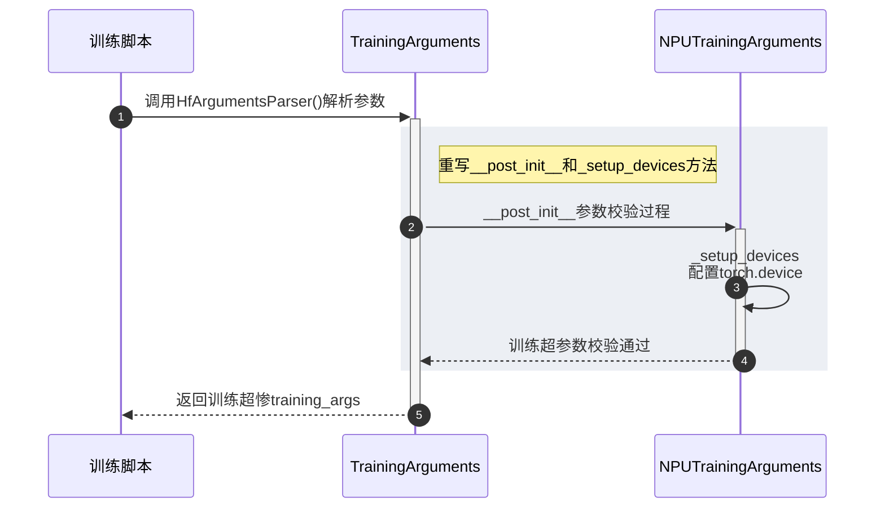
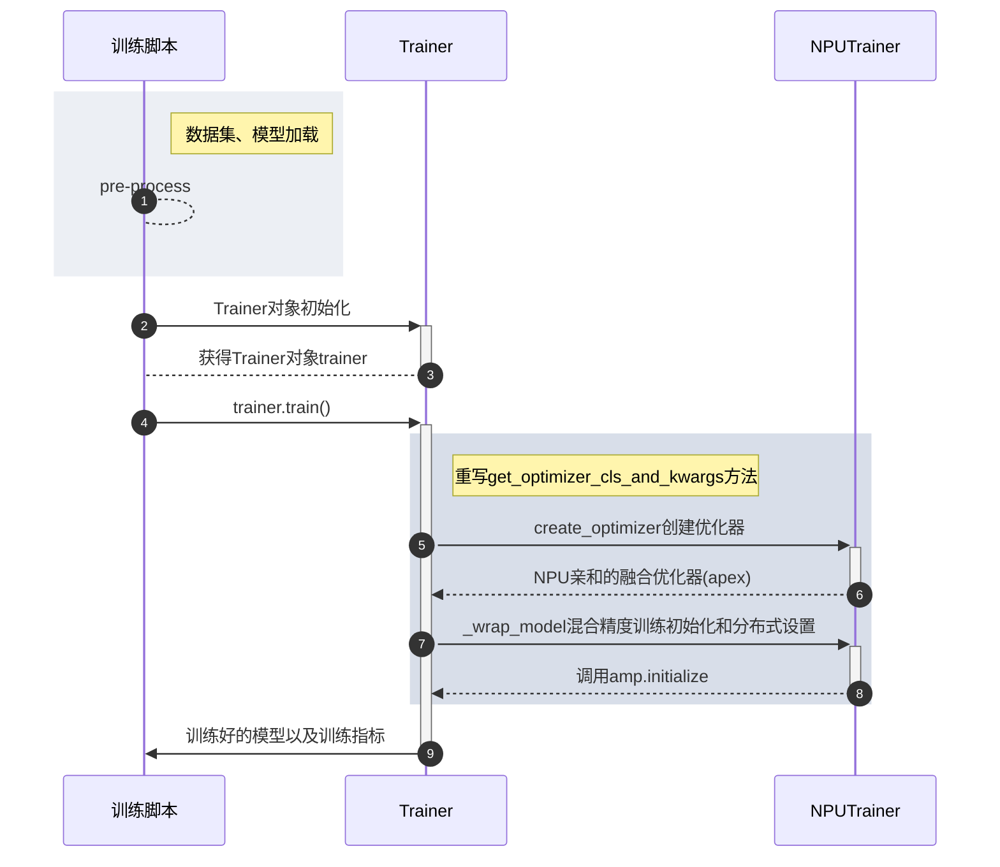

# Transformers 套件适配指导

-   [背景]()
-   [适配原则]()
-   [Transformers适配流程]()
-   [TrainingArguments适配]()
-   [Trainer适配]()
-   [功能验证]()
-   [后续规划]()

## 背景
Transformers 是 Huggin Face开源的NLP算法库，也是目前最流行的预训练模型库，提供了数以万计的类transformer结构的预训练模型。从2017年启动开源至今，Transfromers 已在 Github 累计收获 100k+ star，在开源 AI领域领先于其他单个垂直领域的算法框架。
当前昇腾还未适配Transformers，如果要在NPU上使用Transformers套件训练模型需要自行适配开发，较为繁琐。本项目旨在降低在昇腾NPU上使用Transformers套件的门槛。
## 适配原则

Transformers套件的适配原则如下：
  1. 非侵入式修改，在适配框架中修改而不是直接在原仓库中进行修改。
  2. 尽可能做到上层无感，使得调用方在尽可能少修改代码的情况下能够适配。

为了实现上述目标，我们借助Transformers官方提供的optimum组件和Python提供的monkey-patch特性实现非侵入是修改，用户仅需做少量修改即可运行官方examples示例。
- monkey-patch - 支持 Python 代码运行时动态替换套件的类和方法
- optimum - Hugging Face 官方提供的用于适配第三方硬件的组件

## Transformers适配流程

使用Transformers套件Trainer类训练模型的时序图如下所示：

1. 为了支持NPU上使用Transformers套件需要修改如下接口：

   
2. 通过monkey-patch 动态替换重写的类和方法
   ```python
   @dataclass
   class NPUTrainingArguments(TrainingArgumtens):
      ...
   
   class NPUTrainer(Trainer):
      ...
   
   # optimum/ascend/transfor_to_npu.py
   all_monkey_paths = [
    ["TrainingArguments", optimum.ascend.NPUTrainingArguments],
    ["Trainer", optimum.ascend.NPUTrainer]
   ]
   
   def apply_monkey_patches(monkey_patches):
       for k, v in sys.modules.items():
           if "transformers" in k:
               for dest, patch in monkey_patches:
                   if getattr(v, dest, None):
                       setattr(v, dest, patch)
   
   # Apply monkey patches
   apply_monkey_patches(all_monkey_paths)
   ```
3. 插件使用
   原生训练脚本
   ```python
   from transformers import Trainer, TrainingArguments
   
   training_args = TrainingArguments(
        # training arguments
   )
   
   # A lot of code here
   
   # Initialize our Trainer
   trainer = Trainer(
        model=model,
        args=training_args,
        train_dataset=train_dataset if training_args.do_train else None,
        eval_dataset=eval_dataset if training_args.do_eval else None,
        compute_metrics=compute_metrics,
        tokenizer=tokenizer,
        data_collator=data_collator,
   )
   ```
   NPU 上的训练脚本
   ```diff
   + from optimum.ascend import transfor_to_npu
   from transformers import Trainer, TrainingArguments
   
   training_args = TrainingArguments(
        # training arguments
   )
   
   # A lot of code here
   
   # Initialize our Trainer
   trainer = Trainer(
        model=model,
        args=training_args,
        train_dataset=train_dataset if training_args.do_train else None,
        eval_dataset=eval_dataset if training_args.do_eval else None,
        compute_metrics=compute_metrics,
        tokenizer=tokenizer,
        data_collator=data_collator,
   )
   ```

## TrainingArguments适配

TrainingArguments 保存训练的超参数，如是否开启混精，训练使用的device，训练的batch size等等。TrainingArguments 的使用流程图如下：



1. 重写`__post_init__`方法

`__post_init__`方法对TrainingArguments初始化后的超参数进行校验，比如如果设置`--fp16`开启混精，会校验当前的设备类型是否是`cuda`，在NPU上会抛出异常。整个`__post_init__`方法将近1500行，这里通过一个trick尽可能复用原有代码同时规避部分报错，具体实现如下：

   ```
   def __post_init__(self):
        dummy_fp16 = False
        if self.fp16:
            # Avoiding super().__post_init__() raises ValueError
            dummy_fp16 = True
            self.fp16 = False

        super().__post_init__() # There is a lot of code in super().__post_init__().

        if dummy_fp16:
            self.fp16 = True
        dummy_fp16 = False

        # if training args is specified, it will override the one specified in the accelerate config
        if self.half_precision_backend != "apex" and len(self.sharded_ddp) == 0:
            mixed_precision_dtype = os.environ.get("ACCELERATE_MIXED_PRECISION", "no")
            if self.fp16:
                mixed_precision_dtype = "fp16"
            elif self.bf16:
                mixed_precision_dtype = "bf16"
            os.environ["ACCELERATE_MIXED_PRECISION"] = mixed_precision_dtype
   ```
    
    

2. 重写`_setup_devices`方法

`_setup_devices` 用于设置单卡或多卡训练时device属性，在插件里我们只维护NPU和CPU相关的信息，忽略XPU，MPS等三方设备。

```python
 def _setup_devices(self) -> "torch.device":
     requires_backends(self, ["torch"])
     logger.info("PyTorch-Optimum-Ascend: setting up devices")
     if not is_sagemaker_mp_enabled():
         if not is_accelerate_available(min_version="0.20.1"):
             raise ImportError(
                 "Using the `Trainer` with `PyTorch` requires `accelerate>=0.20.1`: Please run `pip install transformers[torch]` or `pip install accelerate -U`"
             )
         AcceleratorState._reset_state(reset_partial_state=True)
     self.distributed_state = None
     if self.no_cuda:
         self.distributed_state = PartialState(cpu=True, backend=self.ddp_backend)
         self._n_gpu = 0
     elif self.deepspeed: # deepspeed is temporarily not supported by Ascend NPU
         pass
     else:
         self.distributed_state = PartialState(backend=self.ddp_backend)
         self._n_gpu = 1
     if not is_sagemaker_mp_enabled():
         device = self.distributed_state.device
         self.local_rank = self.distributed_state.local_process_index
     if (
         torch.distributed.is_available()
         and torch.distributed.is_initialized()
         and self.parallel_mode != ParallelMode.DISTRIBUTED
     ):
         logger.warning(
             "torch.distributed process group is initialized, but parallel_mode != ParallelMode.DISTRIBUTED. "
             "In order to use Torch DDP, launch your script with `python -m torch.distributed.launch`"
         )
     if self.distributed_state.distributed_type == DistributedType.NO:
         if self.no_cuda:
             device = torch.device("cpu")
             self._n_gpu = 0
         else:
             device = torch.device("npu:{}".format(self.device_id) if torch.npu.is_available() else "cpu")
             self._n_gpu = 1
             if device.type == "npu":
                 torch.npu.set_device(device)
                 logger.info("Single Ascend NPU is enabled.")
     return device
```


## Trainer适配



1. 重写 `get_optimizer_cls_and_kwargs`
顾名思义，当使用apex进行混精训练时，可以调用这个方法获取NPU亲和的融合优化器以及超参数。
   ```python
    @staticmethod
    def get_optimizer_cls_and_kwargs(args: TrainingArguments) -> Tuple[Any, Any]:
        """
        Returns the optimizer class and optimizer parameters based on the training arguments.

        Args:
            args (`transformers.training_args.TrainingArguments`):
                The training arguments for the training session.

        """

        # parse args.optim_args
        optim_args = {}
        if args.optim_args:
            for mapping in args.optim_args.replace(" ", "").split(","):
                key, value = mapping.split("=")
                optim_args[key] = value

        optimizer_kwargs = {"lr": args.learning_rate}

        adam_kwargs = {
            "betas": (args.adam_beta1, args.adam_beta2),
            "eps": args.adam_epsilon,
        }
        if args.optim == OptimizerNames.ADAFACTOR:
            # ...
        elif args.optim == OptimizerNames.ADAMW_HF:
            # ...
        elif args.optim in [OptimizerNames.ADAMW_TORCH, OptimizerNames.ADAMW_TORCH_FUSED]:
            # ...
        elif args.optim == OptimizerNames.ADAMW_APEX_FUSED_NPU:
            try:
                from apex.optimizers import NpuFusedAdamW

                optimizer_cls = NpuFusedAdamW
                optimizer_kwargs.update(adam_kwargs)
            except ImportError:
                raise ValueError("Trainer tried to instantiate apex NpuFusedAdamW but apex is not installed!")
        
        # A lot of code here
        return optimizer_cls, optimizer_kwargs
   ```

2. 重写 `__wrap_model`方法
使用apex.amp.initialize接口使能混合精度训练，原生套件只支持动态loss_scale,这里增加静态loss_scale的设置。

   ```python
   def _wrap_model(self, model, training=True, dataloader=None):
     # A lot of code here
   
     # Mixed precision training with apex (torch < 1.6)
     if self.use_apex and training:
         if self.args.loss_scale is None:
             model, self.optimizer = amp.initialize(model, self.optimizer,
                                                    opt_level=self.args.fp16_opt_level,
                                                    combine_grad=self.args.use_combine_grad)
         else:
             model, self.optimizer = amp.initialize(model, self.optimizer,
                                                    opt_level=self.args.fp16_opt_level,
                                                    loss_scale=self.args.loss_scale,
                                                    combine_grad=self.args.use_combine_grad)
   
     # A lot of code here
   ```
3. 使能Torch原生混精能力

   为了避免维护大量代码，这里通过monkey-patch的方式用`torch.npu.amp`替换`torch.cuda.amp`接口来使用Torch原生的混精能力。

   ```python
   def patch_cuda_amp():
       import torch
       import torch_npu  # noqa: F401
       torch.cuda.amp.autocast = torch.npu.amp.autocast
       torch.cuda.amp.GradScaler = torch.npu.amp.GradScaler
   
   
   patch_cuda_amp()
   ```

## 功能验证
通过单元测试和模型端到端测试保证功能和精度正常
- UT：`tests/` 目录下的测试用例
- 模型端到端测试：`examples/` 目录下的整网训练脚本

## 后续规划
1. 参与开源：贡献昇腾使能部分至Hugging Face-Transformers&Accelerate社区
2. 主导开源：Hugging Face - Transformers 插件代码托管至 Ascendshequ gitee/github代码仓
   - 只维护 bugfix 和 Ascend NPU 特性代码