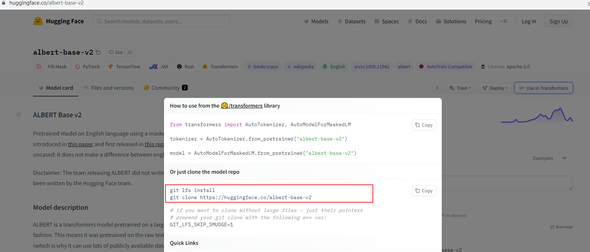
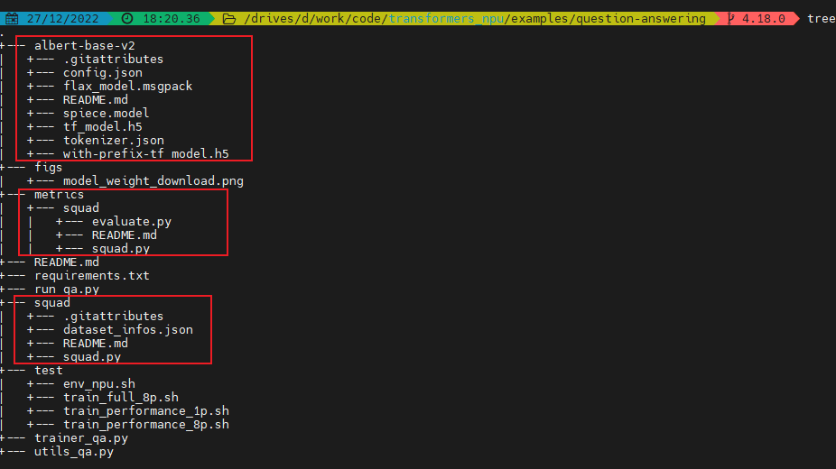

# Question answering
本目录展示如何基于晟腾 NPU 在问答数据集例如 SQuAD 上 fine-tune Transformers 模型。详细说明请参考[官方demo](https://github.com/huggingface/transformers/tree/v4.18.0/examples/pytorch/question-answering)。

## 在 SQuAD1.0 上 fine-tune 模型
`run_qa.py` 用于在问答数据集（例如 SQUAD）上 fine-tune [huggingface hub](https://huggingface.co/models)里任何包含 `ForQuestionAnswering` 结构的模型。

**注意：** `run_qa.py` 只能用于包含 fast tokenizer 的模型的训练，你可以从[这里](https://huggingface.co/transformers/index.html#supported-frameworks)查看模型是否包含 fast tokenizer。

### 准备训练环境
请参考《[Transformers_npu 安装方法](../../README.md)》准备训练环境并安装 Transformers 套件和适配插件。

### 安装依赖
```python
cd ./examples/question-answering/
pip3 install -r requrements.txt
```

### 修改训练脚本run_qa.py
`run_qa.py`、`trainer_qa.py`、`utils_qa.py` 取自 Transformers [官方仓](https://github.com/huggingface/transformers/tree/v4.18.0/examples/pytorch/question-answering)，
需要在 `run_qa.py` 脚本中引入 transformers_npu 插件以支持在晟腾 NPU 上使用 Transformers 套件，具体修改见 `run_qa.py` 第 30 行。

```python
import logging
import os
import sys
from dataclasses import dataclass, field
from typing import Optional

import datasets
from datasets import load_dataset, load_metric

import transformers_npu   # <<< 修改点
import transformers
from trainer_qa import QuestionAnsweringTrainer
from transformers import (
    AutoConfig,
    AutoModelForQuestionAnswering,
    AutoTokenizer,
    DataCollatorWithPadding,
    EvalPrediction,
    HfArgumentParser,
    PreTrainedTokenizerFast,
    TrainingArguments,
    default_data_collator,
    set_seed,
)
from transformers.trainer_utils import get_last_checkpoint
from transformers.utils import check_min_version
from transformers.utils.versions import require_version
from utils_qa import postprocess_qa_predictions
```

### 准备模型权重、数据集脚本和 metrics 脚本
为避免网络波动导致模型权重、数据集和 metrics 脚本下载失败，这里介绍从本地加载模型权重，数据集下载脚本和 metrics 脚本的方法。
1. 下载模型权重

    这里以 albert-base-v2 为例。访问 [huggingface hub](https://huggingface.co/models) 并搜索 `albert-base-v2`，选择 `Use in Transformers`
    获取 git 下载地址，如下图所示
 

    Git 执行如下命令：

    ```shell
    git lfs install
    git clone https://huggingface.co/albert-base-v2
    ```
   
2. 下载数据集脚本

    执行如下命令下载问答数据集脚本

    ```shell
    git clone https://huggingface.co/datasets/squad
    ```

3. 下载 metrics 脚本

    执行如下命令下载 metrics 脚本
   
    ```shell
    git clone https://github.com/huggingface/datasets.git
    ```
4. 将上述文件移动到跟训练脚本 `run_qa.py` 同级目录下

    如下图所示
    

### 训练模型
```shell
cd ./examples/question-answering/test/
# 执行单卡训练脚本
bash ./train_performance_1p.sh --model_name=bart-base # 不指定模型名，则默认为 albert-base-v2

```

## 训练结果展示
**注：** NPU 数据基于测试版本给出，需要补充商发版本的数据。
<table>
    <tr>
        <td colspan="2">models</td>
        <td>F1</td>
        <td>FPS</td>
        <td>Epochs</td>
        <td>AMP_Type</td>
    </tr>
    <tr>
        <td rowspan="4">bart-base</td>
        <td>1p-GPU</td>
        <td>-</td>
        <td>60.247</td>
        <td align="center">1</td>
        <td align="center">O2</td>
    </tr>
    <tr>
        <td>1p-NPU</td>
        <td>-</td>
        <td>76.549</td>
        <td align="center">1</td>
        <td align="center">O2</td>
    </tr>
    <tr>
        <td>8p-GPU</td>
        <td>89.8722</td>
        <td>319.242</td>
        <td align="center">2</td>
        <td align="center">O2</td>
    </tr>
    <tr>
        <td>8p-NPU</td>
        <td>89.7334</td>
        <td>555.023</td>
        <td align="center">2</td>
        <td align="center">O2</td>
    </tr>
    <tr>
        <td rowspan="4">albert-base-v2</td>
        <td>1p-GPU</td>
        <td>-</td>
        <td>38.294</td>
        <td align="center">1</td>
        <td align="center">O1</td>
    </tr>
    <tr>
        <td>1p-NPU</td>
        <td>-</td>
        <td>93.482</td>
        <td align="center">1</td>
        <td align="center">O1</td>
    </tr>
    <tr>
        <td>8p-GPU</td>
        <td>90.8276</td>
        <td>570.732</td>
        <td align="center">2</td>
        <td align="center">O1</td>
    </tr>
    <tr>
        <td>8p-NPU</td>
        <td>88.7564</td>
        <td>700.265</td>
        <td align="center">2</td>
        <td align="center">O1</td>
    </tr>
</table>


## 问题
1. 模型 bart evalation 阶段报 ”ValueError: `predictions` should be a tuple with two elements (start_logits, end_logits)." 

    ```python
    def post_processing_function(examples, features, predictions, stage="eval"):
        # Post-processing: we match the start logits and end logits to answers in the original context.
        predictions = postprocess_qa_predictions(
            examples=examples,
            features=features,
            predictions=predictions,   # >>> predictions=predictions[0:2],
            version_2_with_negative=data_args.version_2_with_negative,
            n_best_size=data_args.n_best_size,
            max_answer_length=data_args.max_answer_length,
            null_score_diff_threshold=data_args.null_score_diff_threshold,
            output_dir=training_args.output_dir,
            log_level=log_level,
            prefix=stage,
        )
    ```

2. 模型 bart evalation 阶段报内存溢出
    
    训练参数增加 `--max_eval_samples 2000`